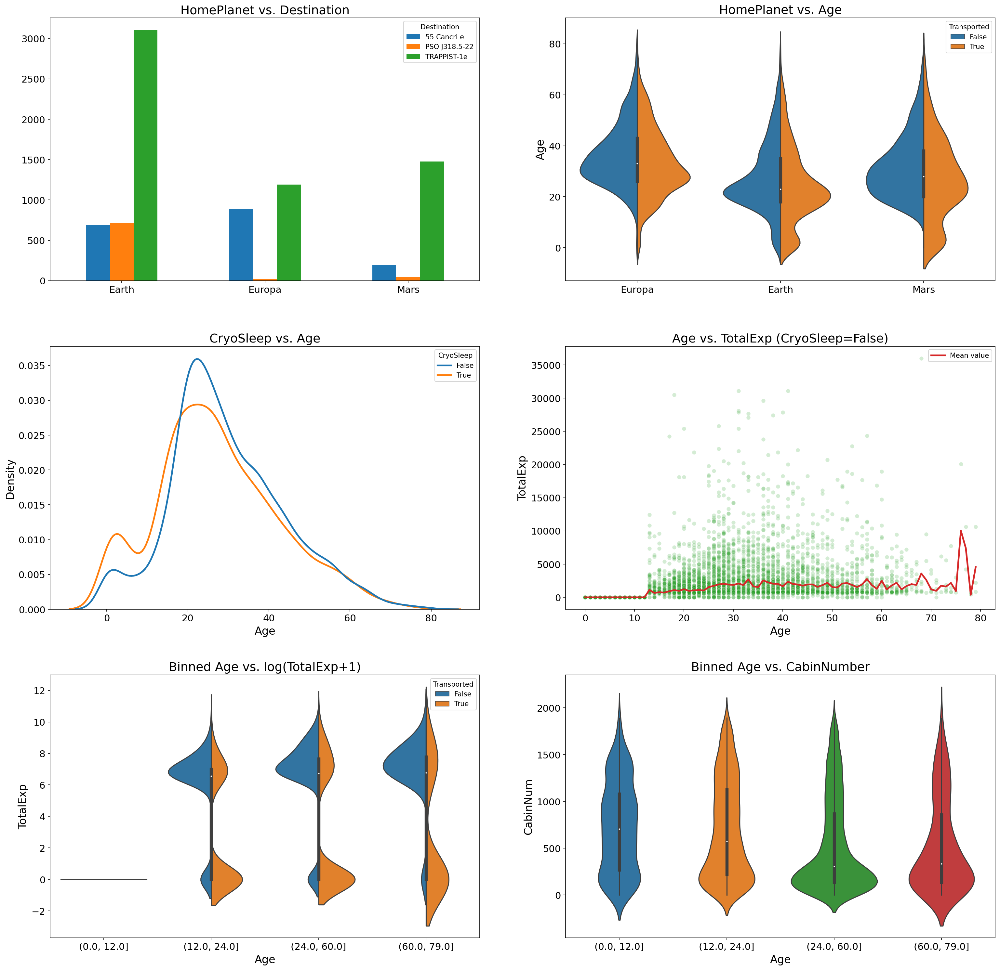

# Spaceship-Titanic-Kaggle-Challenge

The following repository provides my personal approach to the [Spaceship Titanic Kaggle Challenge](https://www.kaggle.com/competitions/spaceship-titanic). My best submission was created using the GradientBoostingClassifier and a lot of experimenting and reached **over 80.8% (Top 6%, place 157/2455 on 09.08.22)**. The GB-Classifier included in the notebook is reproducible and scores over 80.4% on the test data. 

Note: Only two of the models explored during the modeling process are covered in the [notebook](https://github.com/PatrickSVM/Spaceship-Titanic-Kaggle-Challenge/blob/main/Spaceship_Titanic_Kaggle_Project.ipynb).

 

As part of the analysis, I will not only take a look at the provided features alone, but will also discover relationships amongst variables, engineer new features and investigate different strategies to fill missing values in the dataset. I will describe very detailed what I am analyzing, which insights the different plots provide, why I choose certain values for missing data imputation, etc.

The goal of the whole process is to gain a deep understanding of the different features and of course to clean the dataset, before starting to engineer models to predict the target variable "Transported".

The modeling process itself is *not the main goal of this notebook*. But in the end of it, in section 5, I will also cover two example baseline ensemble models, one RandomForest and one GradientBoostingClassifier, both scoring over 80% on the test data. The hyperparameter values used were defined by tuning the models via GridSearchCV, which is not part of the jupyter notebook. 

